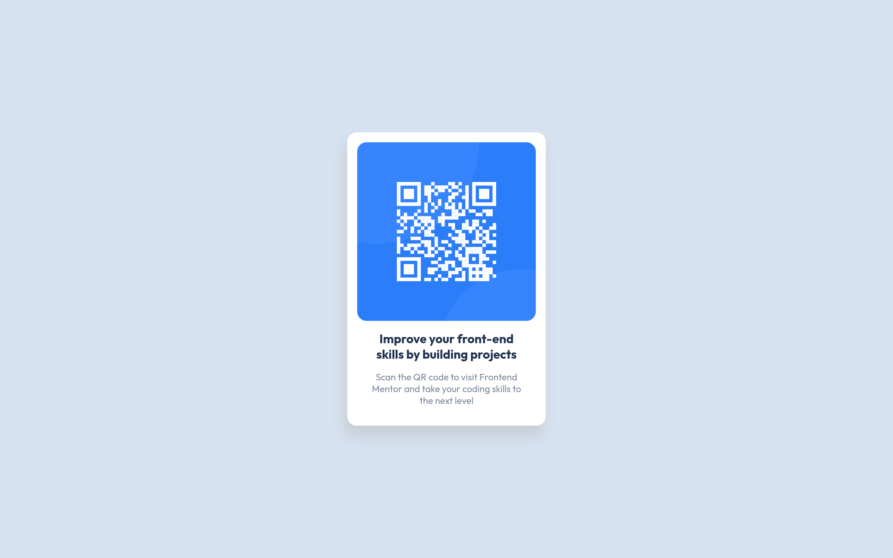
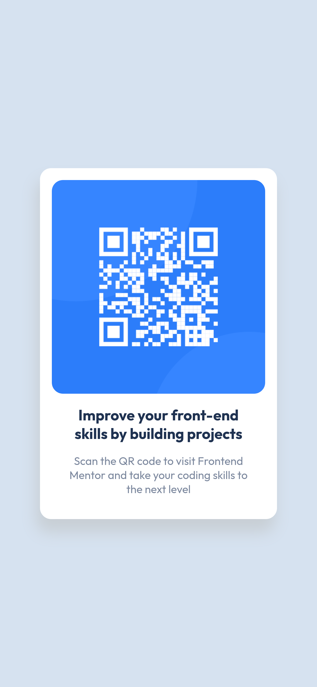

# Frontend Mentor - QR code component solution

This is a solution to the [QR code component challenge on Frontend Mentor](https://www.frontendmentor.io/challenges/qr-code-component-iux_sIO_H). Frontend Mentor challenges help you improve your coding skills by building realistic projects.

## Table of contents

- [Overview](#overview)
  - [Screenshot](#screenshot)
  - [Links](#links)
- [My process](#my-process)
  - [Built with](#built-with)
  - [What I learned](#what-i-learned)
  - [Continued development](#continued-development)
  - [Useful resources](#useful-resources)
- [Author](#author)

**Note: Delete this note and update the table of contents based on what sections you keep.**

## Overview

### Screenshot

#### Desktop



#### Mobile



### Links

- Solution URL: [Solution URL](https://github.com/rudimediaz/fem-challenge-qr__code)
- Live Site URL: [Live site URL](https://rudhifemqrchallenge.netlify.app/)

## My process

### Built with

- Semantic HTML5 markup
- CSS custom properties
- Flexbox
- CSS Grid
- Mobile-first workflow
- [Vite](https://vitejs.dev/) - Bundler

### What I learned

Using flexbox + css min function to avoid horizontal overflow when i center within the container and to make content width stay consistent when user on large screen.

```css
/* container */
.ctn {
  display: flex;
  flex-direction: column;
  justify-content: center;
  align-items: center;
}
/* content */
.card {
  display: flex;
  flex-wrap: wrap;
  width: min(85vw, 320px);
  background-color: white;
  padding: 1rem;
  gap: 1rem;
  box-shadow: -4px 17px 20px 1px hsl(206deg 13% 81%);
}
```

### Continued development

- Add dark mode
- Refine shadow on card component
- Make it responsive when user on landscape orientation device.

### Useful resources

- [3 modern CSS techniques for responsive design](https://www.youtube.com/watch?v=VsNAuGkCpQU&t) - This helped me for dealing with responsive design and component sizing.
- [Thinking on ways to solve CENTERING](https://www.youtube.com/watch?v=ncYzTvEMCyE) - This is an amazing video about how to choose centering strategy.

## Author

- Website - Working on it
- Frontend Mentor - [@rudimediaz](https://www.frontendmentor.io/profile/rudimediaz)
- Twitter - [@rudimediaz](https://twitter.com/rudimediaz)
